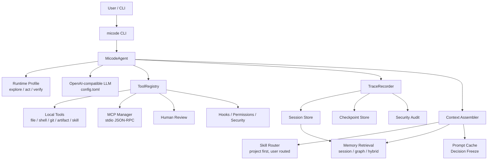
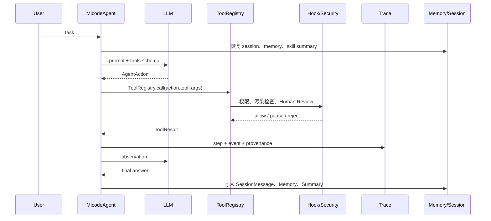
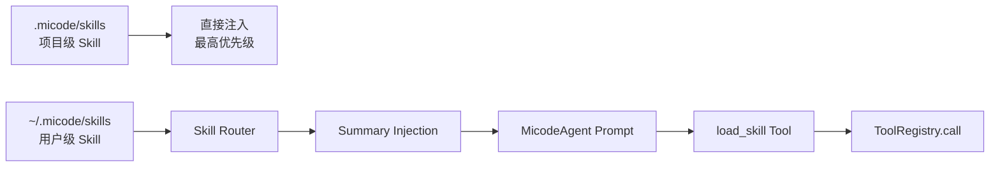
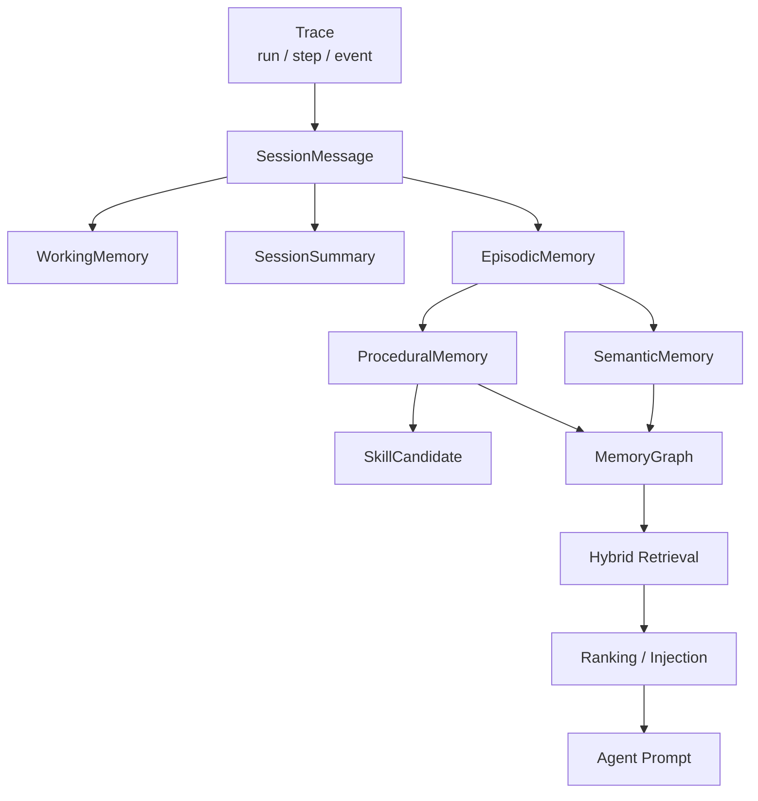
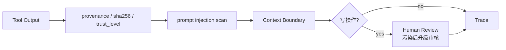
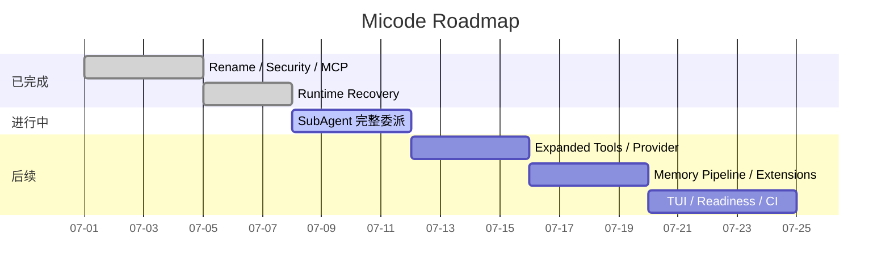

# Micode


Micode 是一个从零手写 Coding Agent 的学习项目。它以 MiniCode-Python 的固定参考基线为能力对齐目标，但代码和设计都围绕自己的学习路线逐章实现：先跑通最小 Agent Loop，再逐步加入 ToolRegistry、Trace、Memory、Skill、Context、Security、MCP、Runtime Recovery 和 SubAgent。

这个仓库的重点不是“套壳调用模型”，而是把一个 Coding Agent 拆成能理解、能测试、能继续扩展的工程系统。

## 当前状态

```text
基础闭环        done    Run / Step / Event、Trace、CLI、文件与 Shell 工具
工具系统        done    ToolRegistry、ToolResult、权限、Hook、metadata 契约
LLM 接入        done    OpenAI-compatible client、config.toml、tool calls
Skill 系统      done    项目级优先、用户级路由、按需 load_skill、候选沉淀
Memory 系统     done    Session、Working、Summary、Episodic、Semantic、Procedural、Graph
Context 系统    done    分层上下文、工具结果摘要、Artifact、Prompt Cache、Decision Freeze
安全系统        done    untrusted 边界、注入检测、污染后写操作升级、Human Review
MCP             done    stdio JSON-RPC、tool/resource/prompt、权限、超时、重连
恢复能力        done    session inspect/replay/summary、checkpoint、rewind preview
SubAgent        working fresh/fork、前台/后台、持久化与结构化摘要仍在补齐
```

最新对齐表见 [`docs/reference_parity.md`](docs/reference_parity.md)。固定参考基线是 `QUSETIONS/MiniCode-Python@b10f9eb79f37682ed5dbdc8a6663567533488048`。

## 系统架构



## Agent Loop



## 核心模块

| 模块 | 位置 | 说明 |
|---|---|---|
| Agent | [`src/micode/agent.py`](src/micode/agent.py) | 主循环、LLM action 解析、工具调用、Trace 与上下文桥接。 |
| Runtime | [`src/micode/runtime.py`](src/micode/runtime.py) | 流式事件、阶段、终止原因、运行画像。 |
| ToolRegistry | [`src/micode/tools/registry.py`](src/micode/tools/registry.py) | 统一工具注册、调用、权限、生命周期关闭。 |
| Security | [`src/micode/security.py`](src/micode/security.py) | untrusted 内容、prompt injection 风险和污染传播。 |
| Human Review | [`src/micode/human_review.py`](src/micode/human_review.py) | 可暂停、可恢复、可拒绝的人工审核记录。 |
| MCP | [`src/micode/mcp/`](src/micode/mcp/) | MCP server 配置、stdio client、发现与调用。 |
| Memory | [`src/micode/memory/`](src/micode/memory/) | 会话、工作记忆、长期记忆、图谱、检索和 review。 |
| Skill | [`src/micode/skills.py`](src/micode/skills.py) | Skill 加载、项目级优先、用户级筛选和候选沉淀。 |
| Checkpoint | [`src/micode/checkpoints.py`](src/micode/checkpoints.py) | 内容寻址 checkpoint、preview、冲突安全 rewind。 |
| SubAgent | [`src/micode/subagents/`](src/micode/subagents/) | 委派任务的实现、测试、审查、fork 运行基础。 |

## 安装

Micode 兼容 Python 3.9+。

```bash
python3 -m pip install -e '.[test]'
cp config.example.toml config.toml
micode --help
```

`config.toml` 是本地明文配置文件，仓库只提交无密钥的 [`config.example.toml`](config.example.toml)。请不要把真实 key 加回 Git 跟踪。

## 配置示例

```toml
[llm]
provider = "openai-compatible"
model = "your-model"
base_url = "https://api.example.com/v1"
api_key = "your-local-key"

[runtime]
profile = "single"
max_turns = 8

[mcp.servers.demo]
command = "python3"
args = ["tests/fixtures/mock_mcp_server.py"]
timeout_seconds = 5
```

## 常用命令

```bash
# 固定任务
micode run "list files"
micode run "run tests"

# 使用真实 LLM 执行 Agent Loop
micode agent "阅读 README 并总结项目能力" --config config.toml

# 继续已有会话
micode agent "继续刚才的任务" --session-id <session-id>

# Trace / Session / Checkpoint
micode trace list
micode session inspect <session-id>
micode session replay <session-id>
micode checkpoint preview <checkpoint-id>

# 安全与 MCP 检查
micode security-review <trace-file>
micode mcp-inspect --config config.toml

# 旧状态迁移
micode migrate-state
```

## 状态目录

```text
.micode/
  artifacts/          大型工具结果和可追踪产物
  checkpoints/        内容寻址 checkpoint blob 与 manifest
  human-reviews/      待审核、已批准、已拒绝、已取消记录
  memory/             长期记忆、图谱、检索索引入口
  prompt-cache/       prompt cache 和决策冻结记录
  sessions/           session、message、summary
  skills/             项目级 skill
  traces/             run / step / event 执行记录
```

旧 `.minicode` 不会自动迁移。需要显式运行：

```bash
micode migrate-state
```

迁移过程会逐文件复制并校验 SHA-256；目标文件已存在且内容一致时返回 `unchanged`，内容冲突时不会覆盖。

## Skill 流程



Skill 的正式结构保持克制：

```python
Skill(name, description, content, tags)
```

`When to use`、`When not to use` 和 `examples/` 会被路由器读取为检索画像，但不会污染 Skill 的四字段契约。项目级 Skill 默认优先，不参与筛选；用户级和外部 Skill 需要经过路由。

## Memory 流程



Memory 的目标是让 Agent 逐渐记住三类东西：

- 发生过什么：`SessionMessage`、`EpisodicMemory`。
- 稳定事实是什么：`SemanticMemory`、`TemporalFact`、`MemoryGraph`。
- 以后遇到类似任务怎么做：`ProceduralMemory`、`SkillCandidate`。

## 安全模型



Micode 默认把外部工具结果、MCP 输出、未知来源内容当作不可信数据处理。只要上下文被污染，后续写文件、执行高风险 shell、调用写型 MCP tool 都会升级审核，并把审核结果写入 Trace。

## 测试

```bash
python3 -m compileall -q src tests
python3 -m pytest
git diff --check
```

最近一次完整验证记录：`412 passed in 3.23s`。随着 SubAgent、扩展工具、Provider readiness、TUI/headless 等后续里程碑推进，测试集会继续扩大。

## 路线图



## 主要文档

- [`docs/SDD.md`](docs/SDD.md)：总设计与学习记录。
- [`docs/stage1/README.md`](docs/stage1/README.md)：第一阶段基础闭环。
- [`docs/stage2/README.md`](docs/stage2/README.md)：第二阶段 Skill、Memory、Context、多 Agent、安全和 MCP。
- [`docs/stage2/roadmap.md`](docs/stage2/roadmap.md)：Day 31 之后的章节安排。
- [`docs/stage3_runtime_recovery.md`](docs/stage3_runtime_recovery.md)：运行时、Session 恢复、Checkpoint/Rewind。
- [`docs/migration.md`](docs/migration.md)：从 `.minicode` 到 `.micode` 的迁移说明。
- [`docs/reference_parity.md`](docs/reference_parity.md)：与固定参考基线的能力对齐表。

## 项目定位

Micode 仍然是一个学习项目。它追求的是每个能力都能被解释、被测试、被逐步替换，而不是一次性堆出一个不可理解的黑箱。仓库里的中文注释、Day 文档和复盘笔记，都是为了把“会用 Agent”推进到“能亲手写出 Agent”。
